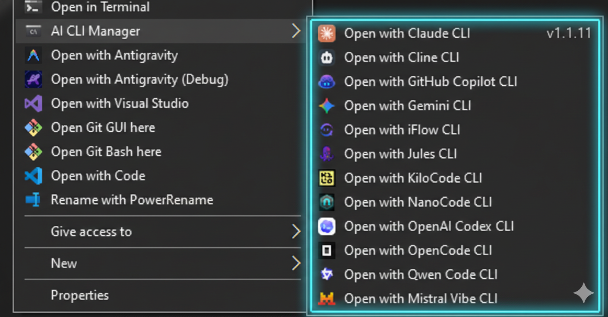
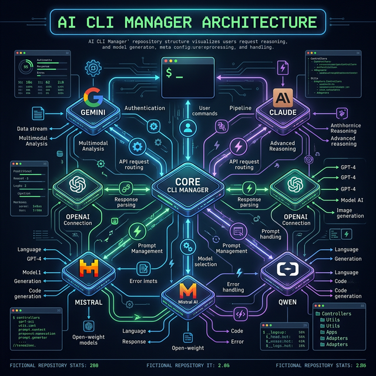

# 🤖 AI CLI Manager
> **Your Central Hub for AI Coding Assistants on Windows & Linux.**

## Overview
**AI CLI Manager (v1.1.11)** is a powerful command-line utility designed to simplify the installation, management, and launching of various AI coding assistants. It bridges the gap between different AI tools, providing a unified interface and seamless Windows integration.

---

## ✨ Key Features
*   **Unified Launcher**: Launch any supported AI CLI (Gemini, Claude, Copilot, etc.) with a single keystroke.
*   **Smart Installation**: Automated dependency checks (Node.js, Python, Git) and one-click installs for missing tools.
*   **Windows Integration**: Add a cascading "Open with AI CLI" menu to your right-click context menu in File Explorer.
*   **Cross-Platform**: Primary focus on Windows (Batch) with robust support for Linux & macOS (Shell).
*   **Session Awareness**: Comprehensive logging and registry backup utilities for system safety.

---

## 🚀 Quick Start

### 💻 Windows (Primary)
1.  **Run**: Double-click `AI_CLI_Manager.bat`.
2.  **Elevate**: The script automatically requests Administrator privileges for system integrations.
3.  **Terminal**: Automatically detects **Windows Terminal**; falls back to standard CMD if needed.

### 🐧 Linux & macOS
1.  **Permission**: `chmod +x AI_CLI_Manager.sh`
2.  **Run**: `./AI_CLI_Manager.sh`
3.  *See [LINUX_MAC_README.md](LINUX_MAC_README.md) for platform-specific details.*

---

## 📋 Supported Tools
The manager supports a wide range of industry-leading AI models and CLI agents:

| Tool | Package | Command | Installation |
|:---|:---|:---|:---|
| **Gemini** | `@google/gemini-cli` | `gemini` | NPM |
| **Jules** | `@google/jules` | `jules` | NPM |
| **Claude** | `@anthropic-ai/claude-code` | `claude` | NPM |
| **OpenAI Codex** | `@openai/codex` | `codex` | NPM |
| **Mistral Vibe** | `mistral-vibe` | `vibe` | PIP (Python) |
| **GitHub Copilot** | `@github/copilot` | `copilot` | NPM |
| **Qwen Code** | `@qwen-code/qwen-code` | `qwen` | NPM |
| **Cline** | `cline` | `cline` | NPM |
| **iFlow** | `@iflow-ai/iflow-cli` | `iflow` | NPM |
| **OpenCode** | `opencode-ai` | `opencode` | NPM |
| **KiloCode** | `@kilocode/cli` | `kilocode` | NPM |
| **NanoCode** | `nanocode-agent` | `nanocode` | Git + Link |
| **Junie** | `Official Script` | `junie` | PowerShell / Curl |

> **Note on Installation**: Smart Install (Option `I`) automatically manages Node.js, Python, and Git. Git-based tools like NanoCode are cloned into the `/Tools` directory and linked via `npm link`.

---

## 🛠️ Menu Guide

### **1. Management & Versions**
*   **`I` Check and Install All**: Scans for all supported tools and installs missing ones automatically.
*   **`V` Show Versions**: Lists specific installed versions or marks them as `[NOT INSTALLED]`.

### **2. Launch CLIs (`1-13`)**
Launches the selected tool in the current directory (or a specified path) using the best available terminal emulator.

### **3. Context Menu Integration**
*   **`A` Add to Windows Context Menu**: (Pro-Tip 🔥) Adds a right-click "Open with AI CLI" menu to Explorer.
    - **How to use**: Right-click any folder or empty space > Hover over "Open with AI CLI" > Select your agent.
*   **`B` Remove Menu**: Cleanly uninstalls registry entries.
*   **`C` Registry Backup**: **Highly Recommended** before using Option `A`. Saves a `.reg` file to the `Log Files` folder.

### **4. System Utilities**
*   **`D` Restart Explorer**: Instantly applies visual/registry changes.
*   **`E` Deep Refresh Icons**: Force-clears icon cache if menu icons look broken.

---

## 🐧 Testing Linux Scripts on Windows
You can run `AI_CLI_Manager.sh` on Windows for cross-platform testing:
*   **Option 1: Git Bash**: Right-click folder > "Open Git Bash Here" > `./AI_CLI_Manager.sh`.
*   **Option 2: WSL (Recommended)**: Navigate to your project folder (e.g., `/mnt/c/Users/...`) in your WSL terminal for a true Linux environment.

---

## 🔍 Troubleshooting & Logs
| Issue | Solution |
|:---|:---|
| **"Access Denied"** | Right-click > "Run as Administrator". |
| **Menu not appearing** | Use Option `D` (Restart Explorer). |
| **Broken Icons** | Use Option `E` (Deep Refresh). |
| **PATH errors** | Restart your computer after new tool installations. |

*   **Logs**: `AI_CLI_MG_YYYYMMDD_HHMMSS.log` in `Log Files/`.
*   **Backups**: `AI_CLI_Backup_YYYYMMDD_HHMMSS.reg` in `Log Files/`.

---

## 📊 Project Visual Overview

## 📚 Documentation Links
- 🛠️ **[Technical Documentation](CODE_DOCUMENTATION.md)**: Deep dive into architecture and logic.
- 🎨 **[Design Philosophy](DESIGN_PHILOSOPHY.md)**: The "Why" behind the tool.
- 🤝 **[Contributing Guide](CONTRIBUTING.md)**: How to help improve the tool.
- 🐧 **[Linux & macOS Guide](LINUX_MAC_README.md)**: Platform-specific details.

---

## ⚖️ License & Credits
Licensed under the **GNU General Public License v3**.

**Copyright (C) 2026 Krishna Kanth B**
