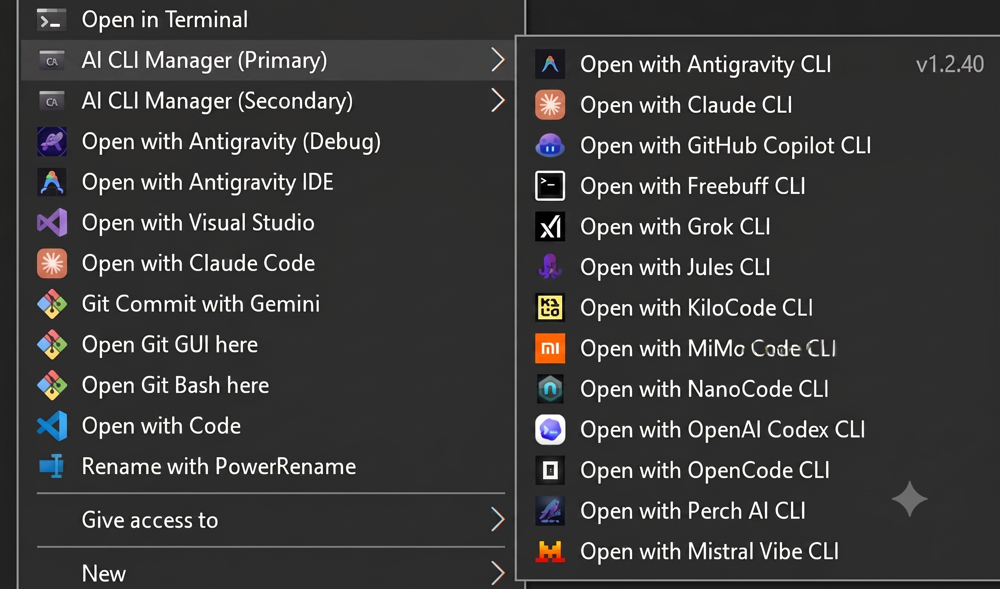
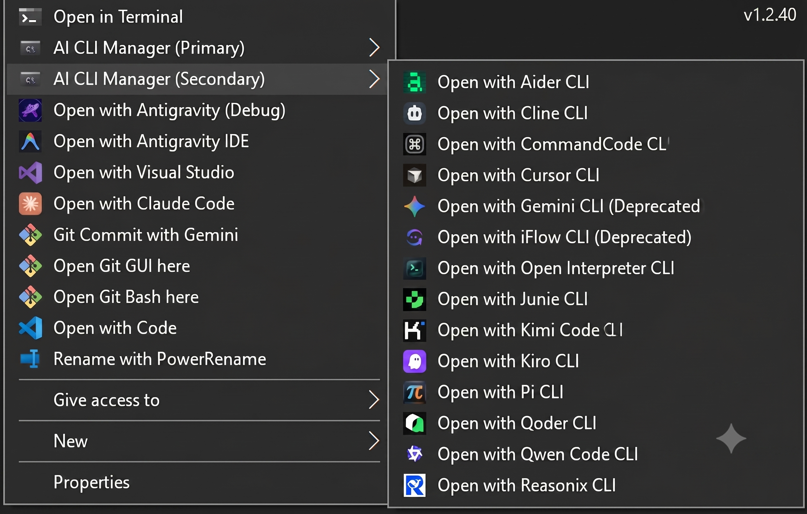
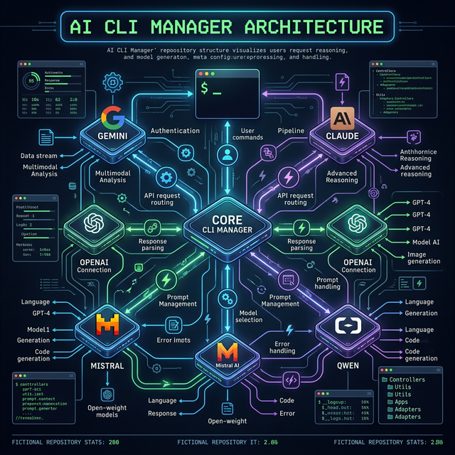

# 🤖 AI CLI Manager
> **Your Central Hub for AI Coding Assistants on Windows & Linux.**

## Overview
**AI CLI Manager (v1.2.42)** is a powerful command-line utility designed to simplify the installation, management, and launching of various AI coding assistants. It bridges the gap between different AI tools, providing a unified interface and seamless Windows integration.

---

## ✨ Key Features
*   **Unified Launcher**: Launch any supported AI CLI (Gemini, Claude, Copilot, etc.) with a single keystroke.
*   **🔥 CLI Beast Mode**: Launch up to 4 AI CLIs simultaneously in a perfectly aligned 2x2 grid (Windows Terminal or tmux).
*   **Smart Installation**: Automated dependency checks (Node.js, Python, Git, curl) and one-click installs for missing tools.
*   **Pre-Launch Validation**: Verifies a CLI is actually installed before attempting to launch — clear error messages guide you to fix it.
*   **Windows Integration**: Add cascading "AI CLI Manager (Primary)" and "AI CLI Manager (Secondary)" menus to your right-click context menu in File Explorer to host all 28 tools without hitting Windows registry limits.
*   **Cross-Platform**: Primary focus on Windows (Batch) with robust support for Linux & macOS (Shell).
*   **Session Awareness**: Comprehensive logging and registry backup utilities for system safety.

---

## 🚀 Quick Start

### 💻 Windows (Primary)
1.  **Run**: Double-click `AI_CLI_Manager.bat`.
2.  **Elevate**: The script automatically requests Administrator privileges for system integrations.
3.  **Terminal**: Automatically detects **Windows Terminal**; falls back to standard CMD if needed.

### 🐧 Linux & macOS
1.  **Permission**: `chmod +x AI_CLI_Manager.sh Multi_CLI_Grid.sh`
2.  **Run**: `./AI_CLI_Manager.sh`
3.  *See [LINUX_MAC_README.md](LINUX_MAC_README.md) for platform-specific details.*

---

## 🔥 CLI Beast Mode (Grid View)
**Beast Mode** is for power users who need to orchestrate multiple AI agents at once. It launches 4 CLIs in a single session, split into quadrants.

### 🚀 How to Launch
- **Windows**: Run `Multi_CLI_Grid.bat` (Requires **Windows Terminal**).
- **Linux/Mac**: Run `./Multi_CLI_Grid.sh` (Requires **tmux**).

### 🛠️ Configuration
1.  **Select Layout**: Choose from **Preset Alpha** (Copilot/Codex/Qoder/Antigravity), **Preset Beta** (KiloCode/Vibe/OpenCode/Qwen), or **Custom Pick**.
2.  **Select Directory**: Enter the path to your project folder when prompted.
3.  **Go!**: The grid opens instantly in that directory. 

> **Note**: Beast Mode supports all **28 tools** (options 1–28), matching the main manager menu.
>
> **Tip**: In `tmux` (Linux/Mac), use `Ctrl+B` then `D` to detach from the grid without killing your active AI sessions.

---

## 📋 Supported Tools
The manager supports a wide range of industry-leading AI models and CLI agents:

| Tool | Package | Command | Installation |
|:---|:---|:---|:---|
| **Gemini (Deprecated)** | `@google/gemini-cli` | `gemini` | NPM |
| **Jules** | `@google/jules` | `jules` | NPM |
| **Claude** | `Official Script` | `claude` | PowerShell / Curl |
| **OpenAI Codex** | `@openai/codex` | `codex` | NPM |
| **Mistral Vibe** | `mistral-vibe` | `vibe` | PIP (Python) |
| **GitHub Copilot** | `@github/copilot` | `copilot` | NPM |
| **Qwen Code** | `@qwen-code/qwen-code` | `qwen` | NPM |
| **Cline** | `cline` | `cline` | NPM |
| **iFlow (Deprecated)** | `@iflow-ai/iflow-cli` | `iflow` | NPM |
| **OpenCode** | `opencode-ai` | `opencode` | NPM |
| **KiloCode** | `@kilocode/cli` | `kilocode` | NPM |
| **NanoCode** | `nanocode-agent` | `nanocode` | Git + Link |
| **Junie** | `Official Script` | `junie` | PowerShell / Curl |
| **Kiro** | `Official Script` | `kiro-cli` | PowerShell / Curl |
| **Qoder** | `@qoder-ai/qodercli` | `qodercli` | NPM |
| **Antigravity** | `Official Script` | `agy` | PowerShell / Curl |
| **Aider** | `aider-chat` | `aider` | PIP (Python) |
| **Open Interpreter** | `open-interpreter` | `interpreter` | PIP (Python) |
| **MiMo Code** | `@mimo-ai/cli` | `mimo` | NPM |
| **Freebuff** | `freebuff` | `freebuff` | NPM |
| **Perch AI** | `perchai-cli` | `perch` | NPM |
| **CommandCode** | `command-code` | `commandcode` | NPM |
| **Pi** | `@earendil-works/pi-coding-agent` | `pi` | NPM |
| **Reasonix** | `reasonix` | `reasonix` | NPM |
| **Cursor** | `agent` | `agent` | Native / CLI |
| **Grok** | `Official Script` | `grok` | PowerShell / Curl |
| **Meta Muse Code (WSL)** | `Official Script` | `muse` | Curl (WSL) |

> **Note on Installation**: Smart Install (Option `I`) automatically manages Node.js, Python, and Git. Git-based tools like NanoCode are cloned into the `/Tools` directory and linked via `npm link`. 

---

## 🔮 Future Candidates
A list of notable AI CLIs under consideration for future integration:

| Name | Reason (TL;DR) |
|:---|:---|
| **Devin CLI** | High-autonomy agent featuring local execution and cloud VM handoff. |
| **Amazon Q Developer** | Powerful AWS-native assistant with command auto-completion and agentic workflows. |
| **CrabCode** | Open-source, Rust-based local agentic CLI with a Terminal User Interface (TUI). |
| **mini-SWE-agent** | Minimalist agentic framework achieving top benchmark results on SWE-bench. |

---

## 🛠️ Menu Guide

### **1. Management & Versions**
*   **`I` Check and Install All**: Scans for all supported tools and installs missing ones automatically.
*   **`V` Show Versions**: Lists specific installed versions or marks them as `[NOT INSTALLED]`.

### **2. Launch CLIs (`1-28`)**

Launches the selected tool in the current directory (or a specified path) using the best available terminal emulator.

### **3. Context Menu Integration**
*   **`A` Add to Windows Context Menu**: (Pro-Tip 🔥) Adds cascading "AI CLI Manager (Primary)" and "AI CLI Manager (Secondary)" menus to Explorer.
    - **How to use**: Right-click any folder or empty space > Hover over "AI CLI Manager (Primary)" or "AI CLI Manager (Secondary)" > Select your agent.
    - **Why two menus?** Windows has a strict built-in registry limit of **16 items per cascading subcommand menu**. To accommodate all 28 tools, they are separated into two cascading menus:
      
      #### **Primary Cascading Menu (Sorted Alphabetically)**
      1. Antigravity CLI (`agy`)
      2. Claude CLI (`claude`)
      3. CommandCode CLI (`commandcode`)
      4. Freebuff CLI (`freebuff`)
      5. GitHub Copilot CLI (`copilot`)
      6. Grok CLI (`grok`)
      7. Jules CLI (`jules`)
      8. KiloCode CLI (`kilocode`)
      9. MiMo Code CLI (`mimo`)
      10. Mistral Vibe CLI (`vibe`)
      11. NanoCode CLI (`nanocode`)
      12. OpenAI Codex CLI (`openai`)
      13. OpenCode CLI (`opencode`)
      14. Perch AI CLI (`perchai`)
      15. Reasonix CLI (`reasonix`)

      #### **Secondary Cascading Menu (Sorted Alphabetically)**
      1. Aider CLI (`aider`)
      2. Cline CLI (`cline`)
      3. Cursor CLI (`cursor`)
      4. Gemini CLI (`gemini` - Deprecated)
      5. iFlow CLI (`iflow` - Deprecated)
      6. Junie CLI (`junie`)
      7. Kimi Code CLI (`kimi`)
      8. Kiro CLI (`kiro`)
      9. Meta Muse Code CLI (`muse` - WSL)
      10. Open Interpreter CLI (`interpreter`)
      11. Pi CLI (`pi`)
      12. Qoder CLI (`qoder`)
      13. Qwen Code CLI (`qwen`)

*   **`B` Remove Menu**: Cleanly uninstalls registry entries.
*   **`C` Registry Backup**: **Highly Recommended** before using Option `A`. Saves a `.reg` file to the `Log Files` folder.

### **4. System Utilities**
*   **`D` Restart Explorer**: Instantly applies visual/registry changes.
*   **`E` Deep Refresh Icons**: Force-clears icon cache if menu icons look broken.

---

## 🐧 Testing Linux Scripts on Windows
You can run `AI_CLI_Manager.sh` on Windows for cross-platform testing:
*   **Option 1: Git Bash**: Right-click folder > "Open Git Bash Here" > `./AI_CLI_Manager.sh`.
*   **Option 2: WSL (Recommended)**: Navigate to your project folder (e.g., `/mnt/c/Users/...`) in your WSL terminal for a true Linux environment.

---

## 🔍 Troubleshooting & Logs
| Issue | Solution |
|:---|:---|
| **"Access Denied"** | Right-click > "Run as Administrator". |
| **Menu not appearing** | Use Option `D` (Restart Explorer). |
| **Broken Icons** | Use Option `E` (Deep Refresh). |
| **PATH errors** | Restart your computer after new tool installations. |
| **"CLI not found in PATH"** | Run Option `I` to install the missing tool, then retry. |
| **Junie/Kiro install fails** | Ensure `curl` (Linux/macOS) or internet access (Windows) is available. |
| **Context menu icons persist after removal** | Use Option `E` (Deep Refresh Icons) after removing the menu. |

*   **Logs**: `AI_CLI_MG_YYYYMMDD_HHMMSS.log` in `Log Files/`.
*   **Backups**: `AI_CLI_Backup_YYYYMMDD_HHMMSS.reg` in `Log Files/`.

---

## 📊 Project Visual Overview

## 📚 Documentation Links
- 🛠️ **[Technical Documentation](CODE_DOCUMENTATION.md)**: Deep dive into architecture and logic.
- 🎨 **[Design Philosophy](DESIGN_PHILOSOPHY.md)**: The "Why" behind the tool.
- 🤝 **[Contributing Guide](CONTRIBUTING.md)**: How to help improve the tool.
- 🐧 **[Linux & macOS Guide](LINUX_MAC_README.md)**: Platform-specific details.

---

## ⚖️ License & Credits
Licensed under the **GNU General Public License v3**.

**Copyright (C) 2026 Krishna Kanth B**
